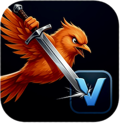

# Viceroy 
**A pure-Swift, zero-dependency character-encoding library. (Alternative to iconv).**

Viceroy transcodes bytes between character encodings with no dependencies. No libiconv, no ICU, no Foundation, nothing but Swift stdlib. Viceroy compiles and runs identically on macOS, Linux, and Windows. There's nothing to install other than a Swift toolchain to build Viceroy.

Viceroy targets the [**WHATWG Encoding Standard**](https://encoding.spec.whatwg.org/). It's a closed, precisely-specified set of ~40 encoders/decoders every web browser uses. This set covers 100% of the character encodings that actually appear in real HTML, XML, and text.

Using Viceroy is simple:

```swift
import Viceroy

// Decode / encode a whole buffer
let input = try Encoding.shiftJIS.decode(bytes)                 // Shift_JIS → String
let output = try Encoding.windows1252.encode("café €")          // String → windows-1252

// Look up by any WHATWG label (case-insensitive, alias-friendly)
let encoder = Encoding(label: "latin1")                         // → windows-1252 (what it's called in WHATWG)

// Convert directly between any two encodings (the iconv analogue)
let utf8 = try Transcoder(from: .big5, to: .utf8).transcode(big5Bytes)

// Stream arbitrary chunks (same output as whole-buffer)
var decoder = StreamingDecoder(.eucJP)
var view = String.UnicodeScalarView()
try decoder.decode(chunk1, into: &view)
try decoder.decode(chunk2, into: &view)
try decoder.finish(into: &view)
```

## Whyroy?

Look, I'm going to be honest with you. I hate character encodings. They're the tower of babel of the modern era. Even bacteria all agree on the same genetic encoding for the STOP codon. Why can't we all just get along? 

But since we can't... Viceroy is here to provide a 🛡️ and a modern alternative to those >25-year-old C-based options. My final straw was trying to just build a Swift library on Windows. It was supposed to have no dependencies, but somehow, iconv got smuggled in with the bathwater. Then, even after doing all of the raindances demanded by the CMAKE ball and chain, the build broke because of an arcane `iconv` vs. `libiconv` naming difference. 

I can't be the only one who is tired of having to walk across these burning coals just to, you know, HAVE TEXT. 

So here's Viceroy, a small, sharp, well-tested library that anyone can use to put a 🗡️ in iconv. 

- Conformance: every character mapping is validated against the vendored WHATWG index files (the same data web-platform-tests derives from). That's 76,981 mappings covered on
  every `swift test`... plus a *fully optional* differential parity test that ensures Viceroy does the same job as your system's `iconv` (if y'know, you still have it installed).
- Performance: table lookups, no per-scalar allocation, `@inlinable` hot-paths, incremental/streaming support so multi-megabyte inputs don't need one giant buffer, and all the runtime safety and memory protections of Swift.
- Determinism: index data is generated once from vendored WHATWG files by a checked-in generator (`Tools/viceroy-tablegen`). Building needs no network and depends on nothing.

## Add as a package dependency:

```swift
.package(url: "https://github.com/gistya/viceroy.git", from: "1.0.0")
```

## The encoding set (complete WHATWG list)

| Family | Encodings |
|---|---|
| **UTF** | UTF-8, UTF-16LE, UTF-16BE |
| **Single-byte** | IBM866, ISO-8859-2/3/4/5/6/7/8/8-I/10/13/14/15/16, KOI8-R, KOI8-U, macintosh, windows-874, windows-1250…1258, x-mac-cyrillic |
| **Chinese** | GBK, gb18030 (incl. the 4-byte algorithmic ranges), Big5 |
| **Japanese** | Shift_JIS, EUC-JP, ISO-2022-JP (stateful) |
| **Korean** | EUC-KR (Wansung + UHC / cp949) |
| **Special** | `replacement` (attack-mitigation), `x-user-defined` |

`ISO-8859-1` / `latin1` / `ascii` map to **windows-1252** per WHATWG. `iso-8859-8-i` is a
distinct encoding sharing the ISO-8859-8 table. **228 labels** resolve to these 40 encodings.

## Error handling

```swift
// Decoding
try enc.decode(bytes, mode: .replacement)   // emit U+FFFD, resync per WHATWG (default)
try enc.decode(bytes, mode: .fatal)         // throw ViceroyError at the first bad unit

// Encoding an unrepresentable scalar
try enc.encode(str, mode: .fatal)                    // throw (default)
try enc.encode(str, mode: .replacement(0x3F))        // emit '?'
try enc.encode(str, mode: .htmlNumericEscape)        // emit &#1234;
try enc.encode(str, mode: .drop)                     // skip it (iconv //IGNORE)
```

Leading BOM gets stripped for UTF-8/UTF-16 (matching `TextDecoder`), even if split across streaming chunk boundaries.

## iconv compatibility shim

For porting existing C call sites, `import ViceroyIConvCompat` gives an `iconv_open`-shaped adapter over `Transcoder`, including `//IGNORE` and `//TRANSLIT` target suffixes:

```swift
import ViceroyIConvCompat

let cd = IConv(fromCode: "SHIFT_JIS", toCode: "UTF-8//IGNORE")!
let out = try cd.convert(input)
```

Of course, we recommend using the modern `Encoding` / `Transcoder` API instead.

## General Architecture

Decoder is a stateful, byte-at-a-time handler. Encoder is a stateful, scalar-at-a-time handler. All partial-sequence state lives inside the handler, never in a side buffer, so a given dataset produces the same output regardless of whether fed through a buffer or as arbitrarily-split chunks.

Streaming ≡ whole-buffer: transcoding goes through a Unicode "pivot" (`decode(A) -> [Unicode.Scalar] -> encode(B)`). This keeps N decoders and N encoders instead of N² converters. In that sense, it's exactly how iconv, encoding_rs, and Go's `x/text` work. Large index tables ship as base64-packed `StaticString`s, making them fast to compile, small, and auditable via the generator. 

## Testing

```
swift test                         # unit tests and conformance sweep
VICEROY_DIFF_ICONV=1 swift test    # adds the OPTIONAL differential parity against system /usr/bin/iconv
```

- The index conformance sweep reconstructs the canonical bytes for every pointer in every vendored WHATWG index and asserts the decoder reproduces the exact code point and the encoder gets us back to start without passing go or collecting $200. This covers all 76,981 mappings.
- "Streaming ≡ whole-buffer" means that the same input fed as one buffer vs. split at every byte boundary must produce identical output. This ensures that split-multibyte and escape bugs don't creep in.
- The differential test vs. system iconv performs a byte-for-byte parity check with the venerable old salt that we claim to replace. 
- No-Foundation guard: if any shipping source imports Foundation or a platform module, the test fails. Just in case some PR ever tries to sneak it in, I guess.

## Regenerating tables

```
swift run viceroy-tablegen        # reads vendor/whatwg and rewrites Sources/Viceroy/Tables, in case they ever change. We'll try to keep them up-to-date here of course.
```

## License

Mozilla Public License 2.0 — see [LICENSE](LICENSE) and [NOTICE](NOTICE).
